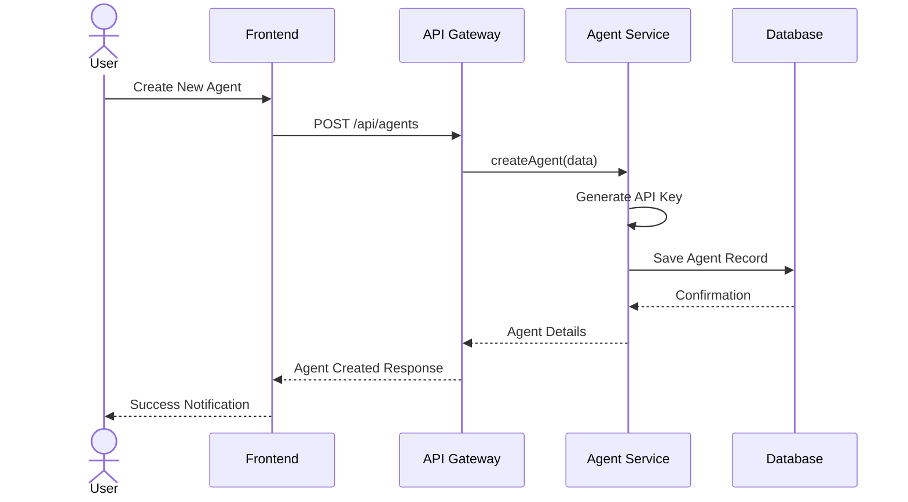
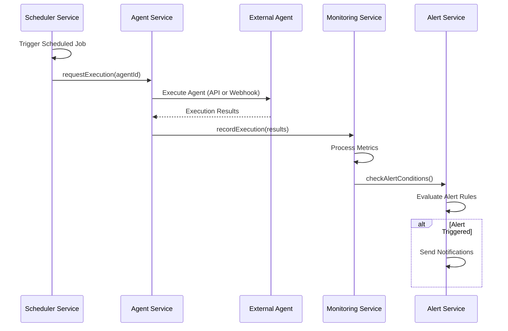
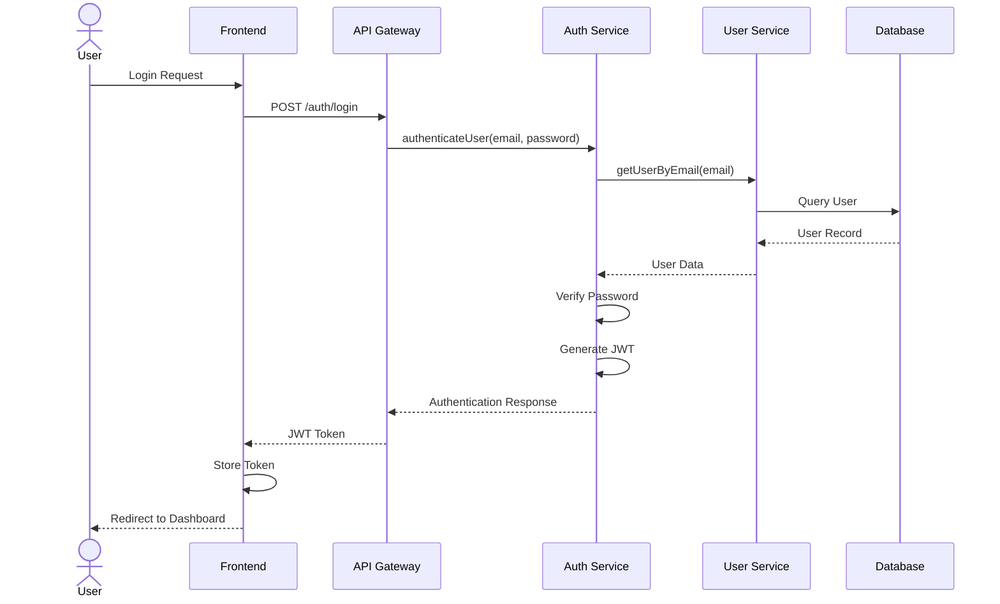

# Project Architecture Overview

## Introduction

The Autonomous Agent Platform is designed as a scalable, maintainable system that follows clean architecture principles and SOLID design practices. This document provides a comprehensive overview of the system architecture, design decisions, and implementation guidelines.

## System Architecture Diagram

```
┌─────────────────────────────────────────────────────────────────────────────────────┐
│                                    CLIENT LAYER                                     │
│                                                                                     │
│  ┌─────────────────────┐  ┌─────────────────────┐  ┌─────────────────────────────┐  │
│  │                     │  │                     │  │                             │  │
│  │   React/Vue Frontend │  │    Admin Dashboard  │  │   Developer Documentation   │  │
│  │                     │  │                     │  │                             │  │
│  └─────────────────────┘  └─────────────────────┘  └─────────────────────────────┘  │
│                                                                                     │
└───────────────────────────────────────┬─────────────────────────────────────────────┘
                                        │
                                        ▼
┌─────────────────────────────────────────────────────────────────────────────────────┐
│                                    API GATEWAY                                      │
│                                                                                     │
│  ┌─────────────────────┐  ┌─────────────────────┐  ┌─────────────────────────────┐  │
│  │                     │  │                     │  │                             │  │
│  │  Authentication     │  │  Rate Limiting      │  │  Request Validation         │  │
│  │  & Authorization    │  │                     │  │                             │  │
│  └─────────────────────┘  └─────────────────────┘  └─────────────────────────────┘  │
│                                                                                     │
└───────────────────────────────────────┬─────────────────────────────────────────────┘
                                        │
                                        ▼
┌─────────────────────────────────────────────────────────────────────────────────────┐
│                                  SERVICE LAYER                                      │
│                                                                                     │
│  ┌─────────────────────┐  ┌─────────────────────┐  ┌─────────────────────────────┐  │
│  │                     │  │                     │  │                             │  │
│  │  Agent Service      │  │  Config Service     │  │  Monitoring Service         │  │
│  │                     │  │                     │  │                             │  │
│  └─────────────────────┘  └─────────────────────┘  └─────────────────────────────┘  │
│                                                                                     │
│  ┌─────────────────────┐  ┌─────────────────────┐  ┌─────────────────────────────┐  │
│  │                     │  │                     │  │                             │  │
│  │  Scheduler Service  │  │  Alert Service      │  │  User Service               │  │
│  │                     │  │                     │  │                             │  │
│  └─────────────────────┘  └─────────────────────┘  └─────────────────────────────┘  │
│                                                                                     │
└───────────────────────────────────────┬─────────────────────────────────────────────┘
                                        │
                                        ▼
┌─────────────────────────────────────────────────────────────────────────────────────┐
│                                  DOMAIN LAYER                                       │
│                                                                                     │
│  ┌─────────────────────┐  ┌─────────────────────┐  ┌─────────────────────────────┐  │
│  │                     │  │                     │  │                             │  │
│  │  Domain Models      │  │  Business Rules     │  │  Domain Events              │  │
│  │                     │  │                     │  │                             │  │
│  └─────────────────────┘  └─────────────────────┘  └─────────────────────────────┘  │
│                                                                                     │
└───────────────────────────────────────┬─────────────────────────────────────────────┘
                                        │
                                        ▼
┌─────────────────────────────────────────────────────────────────────────────────────┐
│                               INFRASTRUCTURE LAYER                                  │
│                                                                                     │
│  ┌─────────────────────┐  ┌─────────────────────┐  ┌─────────────────────────────┐  │
│  │                     │  │                     │  │                             │  │
│  │  DB Repositories    │  │  Redis Cache        │  │  External Integrations      │  │
│  │                     │  │                     │  │                             │  │
│  └─────────────────────┘  └─────────────────────┘  └─────────────────────────────┘  │
│                                                                                     │
│  ┌─────────────────────┐  ┌─────────────────────┐  ┌─────────────────────────────┐  │
│  │                     │  │                     │  │                             │  │
│  │  Message Queue      │  │  Metrics Collectors │  │  Storage Adapters           │  │
│  │                     │  │                     │  │                             │  │
│  └─────────────────────┘  └─────────────────────┘  └─────────────────────────────┘  │
│                                                                                     │
└───────────────────────────────────────┬─────────────────────────────────────────────┘
                                        │
                                        ▼
┌─────────────────────────────────────────────────────────────────────────────────────┐
│                                  DATA LAYER                                         │
│                                                                                     │
│  ┌─────────────────────┐  ┌─────────────────────┐  ┌─────────────────────────────┐  │
│  │                     │  │                     │  │                             │  │
│  │  PostgreSQL         │  │  Redis              │  │  InfluxDB                   │  │
│  │                     │  │                     │  │                             │  │
│  └─────────────────────┘  └─────────────────────┘  └─────────────────────────────┘  │
│                                                                                     │
└─────────────────────────────────────────────────────────────────────────────────────┘
```

## Architecture Components

### 1. Client Layer

The client layer provides user interfaces for different stakeholders:

- **React/Vue Frontend**: The primary user interface for managing agents
- **Admin Dashboard**: Admin-specific views and controls
- **Developer Documentation**: Interactive documentation for API and SDK

**Key Technologies**:
- React or Vue.js (with TypeScript)
- Material-UI or Ant Design for components
- Redux or Vuex for state management
- Jest and React Testing Library for testing

### 2. API Gateway

The API gateway serves as the entry point for all client requests:

- **Authentication & Authorization**: JWT/OAuth2-based access control
- **Rate Limiting**: Prevents abuse and ensures fair usage
- **Request Validation**: Validates incoming requests before processing

**Key Technologies**:
- Express.js with TypeScript
- Passport.js for authentication
- express-rate-limit for rate limiting
- OpenAPI/Swagger for API documentation

### 3. Service Layer

The service layer implements the core business logic:

- **Agent Service**: Manages agent lifecycle and configurations
- **Config Service**: Handles system and agent configuration
- **Monitoring Service**: Tracks agent status and performance
- **Scheduler Service**: Manages scheduled agent executions
- **Alert Service**: Configures and triggers alerts
- **User Service**: Handles user management and permissions

**Key Technologies**:
- Node.js with TypeScript
- Dependency injection for service composition
- Event-driven architecture for service communication
- Jest for unit and integration testing

### 4. Domain Layer

The domain layer contains the core business logic and rules:

- **Domain Models**: Core entities and value objects
- **Business Rules**: Encapsulated business rules and validation
- **Domain Events**: Events representing business state changes

**Key Principles**:
- Domain-Driven Design
- SOLID principles
- Immutable data structures where feasible
- Strong typing with TypeScript

### 5. Infrastructure Layer

The infrastructure layer provides technical capabilities:

- **DB Repositories**: Database access implementations
- **Redis Cache**: Caching and transient data storage
- **External Integrations**: Third-party service connectors
- **Message Queue**: Async processing and integration
- **Metrics Collectors**: System and agent metrics collection
- **Storage Adapters**: Access to different storage systems

**Key Technologies**:
- TypeORM or Sequelize for database access
- Redis client for caching and pub/sub
- BullMQ for job queues
- axios for HTTP clients
- Winston for logging

### 6. Data Layer

The data layer stores persistent and transient data:

- **PostgreSQL**: Primary relational database
- **Redis**: Cache and message broker
- **InfluxDB**: Time-series data for metrics

## System Workflows

### Agent Creation and Provisioning



### Agent Execution Flow



### User Authentication Flow



## Clean Architecture Implementation

### Folder Structure

```
/
├── frontend/                # React/Vue frontend application
│   ├── src/
│   │   ├── components/      # UI components
│   │   ├── pages/           # Page components
│   │   ├── services/        # API client services
│   │   ├── store/           # State management
│   │   └── utils/           # Utility functions
│   └── tests/               # Frontend tests
│
├── backend/                 # Node.js backend application
│   ├── src/
│   │   ├── api/             # API endpoints and controllers
│   │   ├── config/          # Application configuration
│   │   ├── domain/          # Domain models and business logic
│   │   │   ├── agents/
│   │   │   ├── users/
│   │   │   └── monitoring/
│   │   │
│   │   ├── services/        # Service layer implementations
│   │   ├── infrastructure/  # Infrastructure components
│   │   │   ├── database/    # Database access and repositories
│   │   │   ├── cache/       # Caching implementations
│   │   │   ├── queue/       # Message queue implementations
│   │   │   └── external/    # External service integrations
│   │   │
│   │   └── utils/           # Utility functions and helpers
│   │
│   └── tests/               # Backend tests
│       ├── unit/
│       ├── integration/
│       └── e2e/
│
├── sdk/                     # Agent SDK for external developers
│   ├── src/
│   │   ├── agent.ts         # Main agent class
│   │   ├── types.ts         # TypeScript type definitions
│   │   └── utils/           # SDK utilities
│   │
│   └── examples/            # Example agent implementations
│
├── docs/                    # Documentation
│   ├── api/                 # API documentation
│   ├── architecture/        # Architecture documentation
│   ├── developer/           # Developer guides
│   ├── deployment/          # Deployment instructions
│   └── ui/                  # UI wireframes and guidelines
│
└── infrastructure/          # Infrastructure as code
    ├── docker/              # Docker configurations
    ├── kubernetes/          # Kubernetes manifests
    └── aws/                 # AWS CloudFormation/CDK
```

### Dependency Injection

The system uses dependency injection to maintain loose coupling:

```typescript
// Example of dependency injection in a service
import { injectable, inject } from 'inversify';
import { TYPES } from '../types';
import { IAgentRepository } from '../domain/agents/agent-repository.interface';
import { ISchedulerService } from './scheduler-service.interface';

@injectable()
export class AgentService implements IAgentService {
  constructor(
    @inject(TYPES.AgentRepository) private agentRepository: IAgentRepository,
    @inject(TYPES.SchedulerService) private schedulerService: ISchedulerService,
    @inject(TYPES.Logger) private logger: ILogger
  ) {}
  
  async createAgent(data: AgentCreateDto): Promise<Agent> {
    // Implementation using injected dependencies
  }
}
```

### Domain Models

Domain models are the core business entities:

```typescript
// Example domain model
export class Agent {
  private _id: string;
  private _name: string;
  private _type: AgentType;
  private _config: AgentConfig;
  private _status: AgentStatus;
  private _lastHeartbeat?: Date;
  
  constructor(params: AgentParams) {
    this._id = params.id || generateUuid();
    this._name = params.name;
    this._type = params.type;
    this._config = params.config;
    this._status = params.status || AgentStatus.INACTIVE;
  }
  
  // Domain logic methods
  activate(): void {
    if (this._status === AgentStatus.INACTIVE) {
      this._status = AgentStatus.ACTIVE;
    } else {
      throw new AgentStateError('Cannot activate agent in current state');
    }
  }
  
  updateHeartbeat(): void {
    this._lastHeartbeat = new Date();
    if (this._status === AgentStatus.ERROR || this._status === AgentStatus.INACTIVE) {
      this._status = AgentStatus.ACTIVE;
    }
  }
  
  // Getters
  get id(): string { return this._id; }
  get name(): string { return this._name; }
  get type(): AgentType { return this._type; }
  get config(): AgentConfig { return this._config; }
  get status(): AgentStatus { return this._status; }
  get lastHeartbeat(): Date | undefined { return this._lastHeartbeat; }
  
  // Factory method
  static create(params: AgentCreateParams): Agent {
    // Validation logic
    if (!params.name) throw new ValidationError('Agent name is required');
    
    return new Agent({
      id: generateUuid(),
      name: params.name,
      type: params.type,
      config: params.config,
      status: AgentStatus.INACTIVE
    });
  }
}
```

### Repository Pattern

The repository pattern is used for data access:

```typescript
// Repository interface in domain layer
export interface IAgentRepository {
  findById(id: string): Promise<Agent | null>;
  findByApiKey(apiKey: string): Promise<Agent | null>;
  findAll(orgId: string, options?: FindOptions): Promise<AgentListResult>;
  save(agent: Agent): Promise<Agent>;
  delete(id: string): Promise<boolean>;
}

// PostgreSQL implementation in infrastructure layer
@injectable()
export class PostgresAgentRepository implements IAgentRepository {
  constructor(
    @inject(TYPES.DbConnection) private connection: Connection,
    @inject(TYPES.AgentMapper) private mapper: AgentMapper
  ) {}
  
  async findById(id: string): Promise<Agent | null> {
    const record = await this.connection.query(
      'SELECT * FROM agents WHERE id = $1',
      [id]
    );
    
    if (!record || record.rows.length === 0) {
      return null;
    }
    
    return this.mapper.toDomain(record.rows[0]);
  }
  
  // Other methods implementation...
}
```

## SOLID Principles Implementation

### Single Responsibility Principle

Each class and module has a single responsibility:

- **AgentService**: Manages agent lifecycle
- **SchedulerService**: Handles scheduling logic
- **MonitoringService**: Tracks agent status and metrics
- **AlertService**: Manages alerts and notifications

### Open/Closed Principle

The system is designed for extension without modification:

- **Plugin Architecture**: Agent types are implemented as plugins
- **Strategy Pattern**: Different alert conditions use the strategy pattern
- **Middleware Pipeline**: API gateway uses a configurable middleware pipeline

### Liskov Substitution Principle

Subtypes are substitutable for their base types:

- **Repository Implementations**: Any repository implementation can be substituted
- **Authentication Strategies**: Different auth strategies can be swapped

### Interface Segregation Principle

Interfaces are client-specific rather than general-purpose:

```typescript
// Specific interfaces rather than one large interface
interface IAgentCreationService {
  createAgent(data: AgentCreateDto): Promise<Agent>;
  validateAgentConfiguration(config: AgentConfig): Promise<ValidationResult>;
}

interface IAgentQueryService {
  getAgentById(id: string): Promise<Agent | null>;
  listAgentsByOrganization(orgId: string): Promise<Agent[]>;
  searchAgents(criteria: SearchCriteria): Promise<AgentSearchResult>;
}
```

### Dependency Inversion Principle

High-level modules don't depend on low-level modules:

- **Inversion of Control Container**: Using InversifyJS for DI
- **Interface-based Design**: All dependencies are on interfaces
- **Repository Abstractions**: Domain depends on repository interfaces, not implementations

## Scalability Design

### Horizontal Scaling

The system is designed for horizontal scaling:

- **Stateless Services**: API and service containers are stateless
- **Distributed Caching**: Redis for distributed caching
- **Message Queues**: BullMQ for asynchronous processing

### High Availability

High availability is achieved through:

- **Service Redundancy**: Multiple instances of each service
- **Database Replication**: PostgreSQL streaming replication
- **Redis Clustering**: Redis Sentinel for HA Redis

### Resilience Patterns

The system implements several resilience patterns:

- **Circuit Breakers**: Prevent cascading failures
- **Retry Policies**: Automatic retries with exponential backoff
- **Fallbacks**: Graceful degradation when dependencies fail
- **Timeouts**: Prevent indefinite waiting

## Security Considerations

### Authentication & Authorization

- **JWT Authentication**: Short-lived tokens with refresh mechanism
- **OAuth2 Integration**: Support for third-party auth providers
- **Role-Based Access Control**: Granular permissions system
- **API Keys**: For agent authentication

### Data Protection

- **Encryption at Rest**: Database encryption
- **Encryption in Transit**: HTTPS for all communications
- **Sensitive Data Handling**: PII and secrets management

### Security Testing

- **SAST**: Static Application Security Testing
- **DAST**: Dynamic Application Security Testing
- **Dependency Scanning**: Automated vulnerability checks
- **Penetration Testing**: Regular security assessments

## Monitoring and Observability

### Metrics Collection

- **Prometheus**: For system metrics
- **InfluxDB**: For time-series agent metrics
- **Custom Metrics**: Application-specific metrics

### Logging

- **Structured Logging**: JSON-formatted logs
- **Log Aggregation**: Using ELK or similar stack
- **Correlation IDs**: For request tracing

### Alerting

- **Prometheus Alertmanager**: For system alerts
- **Custom Alert Engine**: For agent-specific alerts
- **Multiple Channels**: Email, Slack, webhooks, etc.

## Continuous Integration and Deployment

### CI Pipeline

- **Automated Testing**: Unit, integration, and E2E tests
- **Code Quality**: Linting, formatting, and static analysis
- **Security Scanning**: Dependency and vulnerability scanning

### CD Pipeline

- **Build Process**: Docker image building and tagging
- **Deployment**: Kubernetes deployments with rolling updates
- **Environment Management**: Dev, staging, and production environments

### Infrastructure as Code

- **Kubernetes Manifests**: For container orchestration
- **Helm Charts**: For packaging and deployment
- **Terraform**: For cloud resource provisioning

## Development Workflow

### Version Control

- **Git Flow**: Feature branches, develop, and main branches
- **Code Reviews**: Pull request reviews and approvals
- **Semantic Versioning**: For releases

### Documentation

- **API Documentation**: OpenAPI/Swagger
- **Code Documentation**: JSDoc/TSDoc
- **Architecture Documentation**: ADRs (Architecture Decision Records)

## Conclusion

The Autonomous Agent Platform is designed with clean architecture principles, ensuring:

- **Maintainability**: Through separation of concerns and SOLID principles
- **Scalability**: Through horizontally scalable, stateless services
- **Testability**: Through dependency injection and modular design
- **Flexibility**: Through plugin architecture and extension points

This document serves as a living guide for system architecture and should be updated as the system evolves.
